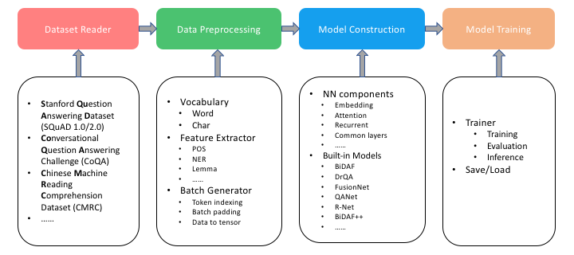

# Sogou Machine Reading Comprehension Toolkit
## Introduction
**The Sogou Machine Reading Comprehension (SMRC)** toolkit was designed for the fast and efficient development of modern machine comprehension models, including both published models and original prototypes.

## Toolkit Architecture


## Installation
```sh
$ git clone https://github.com/sogou/SogouMRCToolkit.git
$ cd mrc-toolkit
$ pip install [-e] .
```
Option *-e* makes your installation **editable**, i.e., it links it to your source directory

This repo was tested on Python 3 and Tensorflow 1.12

## Quick Start
To train a Machine Reading Comprehension model, please follow the steps below.

For SQuAD1.0, you can download a dataset with the following commands.
```sh
$ wget https://rajpurkar.github.io/SQuAD-explorer/dataset/train-v1.1.json
$ wget https://rajpurkar.github.io/SQuAD-explorer/dataset/dev-v1.1.json
$ wget https://nlp.stanford.edu/data/glove.840B.300d.zip #used in DrQA
$ unzip glove.840B.300d.zip
```
Prepare the dataset reader and evaluator.
```python
train_file = data_folder + "train-v1.1.json"
dev_file = data_folder + "dev-v1.1.json"
reader = SquadReader()
train_data = reader.read(train_file)
eval_data = reader.read(dev_file)
evaluator = SquadEvaluator(dev_file)
```
Build a vocabulary and load the pretrained embedding.
```python
vocab = Vocabulary(do_lowercase=False)
vocab.build_vocab(train_data + eval_data, min_word_count=3, min_char_count=10)
word_embedding = vocab.make_word_embedding(embedding_folder+"glove.840B.300d.txt")
```
Use the feature extractor,which is only necessary when using linguistic features.
```python
feature_transformer = FeatureExtractor(features=['match_lemma','match_lower','pos','ner','context_tf'],
build_vocab_feature_names=set(['pos','ner']),word_counter=vocab.get_word_counter())
train_data = feature_transformer.fit_transform(dataset=train_data)
eval_data = feature_transformer.transform(dataset=eval_data)
```
Build a batch generator for training and evaluation,where additional features and a feature vocabulary are necessary when a linguistic feature
is used.
```python
train_batch_generator = BatchGenerator(vocab,train_data, training=True, batch_size=32, \
    additional_fields = feature_transformer.features,feature_vocab=feature_transformer.vocab)
eval_batch_generator = BatchGenerator(vocab,eval_data, batch_size=32, \
    additional_fields = feature_transformer.features, feature_vocab=feature_transformer.vocab)
```
Import the built-in model and compile the training operation, call functions such as train_and_evaluate for training and evaluation.
```python
model = DrQA(vocab, word_embedding, features=feature_transformer.features,\
 feature_vocab=feature_transformer.vocab)
model.compile()
model.train_and_evaluate(train_batch_generator, eval_batch_generator, evaluator, epochs=40, eposides=2)
```
All of the codes are provided using built-in models running on different datasets in the examples. You can check these for details.

## Modules
1. `data`
    - vocabulary.py: Vocabulary building and word/char index mapping
    - batch_generator.py: Mapping words and tags to indices, padding length-variable features, transforming all of the features into tensors, and then batching them
2. `dataset_reader`
    - squad.py: Dataset reader and evaluator (from official code) for SQuAD 1.0
    - squadv2.py : Dataset reader and evaluator (from official code) for SQuAD 2.0
    - coqa.py : Dataset reader and evaluator (from official code) for CoQA
    - cmrc.py :Dataset reader and evaluator (from official code) for CMRC
3. `examples`
    - Examples for running different models, where the specified data path should provided to run the examples
4. `model`
    - Base class and subclasses of models, where any model should inherit the base class
    - Built-in models such as BiDAF, DrQA, and FusionNet
5. `nn`
    - similarity\_function.py: Similarity functions for attention, e.g., dot_product, trilinear, and symmetric_nolinear
    - attention.py: Attention functions such as BiAttention, Trilinear and Uni-attention
    - ops: Common ops
    - recurrent: Wrappers for LSTM and GRU
    - layers: Layer base class and commonly used layers
6. `utils`
    - tokenizer.py: Tokenizers that can be used for both English and Chinese
    - feature_extractor: Extracting linguistic features used in some papers, e.g., POS, NER, and Lemma
7. `libraries`
    - Bert is included in this toolkit with the code from the [official source code](https://github.com/google-research/bert).

## Custom Model and Dataset
- Custom models can easily be added with the description in the [tutorial](./doc/build_custom_model.md).
- A new dataset can easily be supported by implementing a Custom Dataset Reader and Evaluator.

## Performance

### F1/EM score on SQuAD 1.0 dev set
| Model | toolkit implementation | original paper|
| --- | --- | ---|
|BiDAF | 77.3/67.7  | 77.3/67.7 |
|BiDAF+ELMo | 81.0/72.1 | - |
|IARNN-Word | 73.9/65.2 | - |
|IARNN-hidden |  72.2/64.3| - |
|DrQA | 78.9/69.4 | 78.8/69.5  |
|DrQA+ELMO|83.1/74.4 | - |
|R-Net | 79.3/70.8 | 79.5/71.1  |
|BiDAF++ | 78.6/69.2 | -/-  |
|FusionNet | 81.0/72.0 | 82.5/74.1  |
|QANet | 79.3/69.9 | 82.7/73.6  |
|BERT-Base | 88.3/80.6 | 88.5/80.8 |

### F1/EM score on SQuAD 2.0 dev set
| Model | toolkit implementation | original paper|
| --- | --- | ---|
|BiDAF | 62.7/59.7 | 62.6/59.8 |
|BiDAF++ | 64.3/61.8 | 64.8/61.9  |
|BiDAF++ + ELMo  | 67.6/64.8| 67.6/65.1 |
|BERT-Base | 75.9/73.0 | 75.1/72.0 |

### F1 score on CoQA dev set
| Model | toolkit implementation | original paper|
| --- | --- | ---|
|BiDAF++ | 71.7 | 69.2 |
|BiDAF++ + ELMo | 74.5 | 69.2|
|BERT-Base | 78.6 | - |
|BERT-Base+Answer Verification| 79.5 | - |

## Contact information
For help or issues using this toolkit, please submit a GitHub issue.

## Citation
If you use this toolkit in your research, please use the following BibTex Entry
```
@ARTICLE{2019arXiv190311848W,
       author = {{Wu}, Jindou and {Yang}, Yunlun and {Deng}, Chao and {Tang}, Hongyi and
         {Wang}, Bingning and {Sun}, Haoze and {Yao}, Ting and {Zhang}, Qi},
        title = "{Sogou Machine Reading Comprehension Toolkit}",
      journal = {arXiv e-prints},
     keywords = {Computer Science - Computation and Language},
         year = "2019",
        month = "Mar",
          eid = {arXiv:1903.11848},
        pages = {arXiv:1903.11848},
archivePrefix = {arXiv},
       eprint = {1903.11848},
 primaryClass = {cs.CL},
       adsurl = {https://ui.adsabs.harvard.edu/\#abs/2019arXiv190311848W},
      adsnote = {Provided by the SAO/NASA Astrophysics Data System}
}
```
## License
[Apache-2.0](https://opensource.org/licenses/Apache-2.0)

